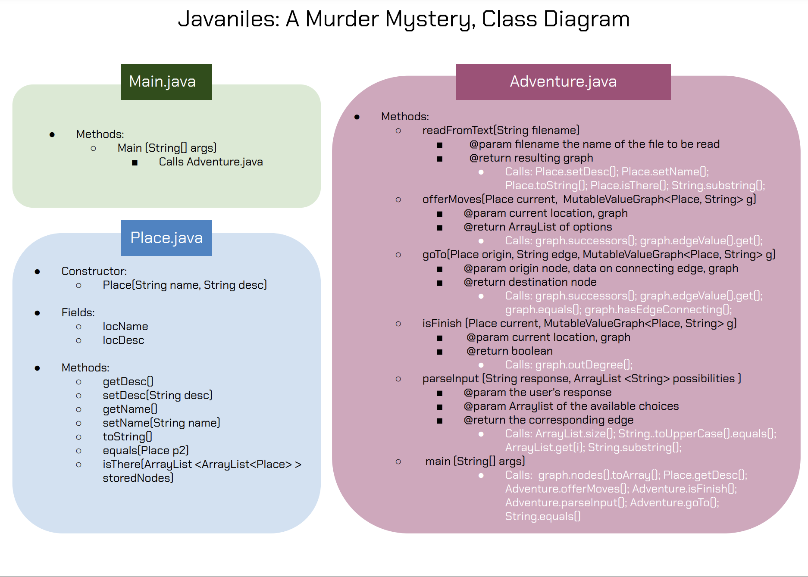

# **Javaniles: A Murder Mystery; Reflection**

# Design Justification:

We are using the external Guava Package to implement the graph that contains our world. We chose to implement a Mutable Value Graph, versus a normal graph or a network for the following reasons: 

* The edges between our nodes represent the options (or potential exits, if you will) of the player. Using a value graph and storing these options on the edges saved us many lines of code and extra methods that we'd have to write using a regular graph.
* Our project doesn't involve any in-game graph expansions, making Immutable graphs a more reasonable choice. However, we wanted to make our project extendable, so we decided to make the "world map" readable from a text file. This required that we modify the graph as we read from the text file, yileding our choice of using a Mutable graph.
* We contemplated writing a class for connections between nodes and storing those on the edges, which would require us to implement a network, but given that we're only storing strings on the edges of the graph we were able to use a value graph.

**Alternative data structure that could've worked, technically:** Using a tree instead of a value graph would've worked to some extent. Often our game feels like a binary tree where the user has two choices and has to pick between them. However, that wouldn't be very engaging and we wanted to create loops that take you back to places and require you to make a certain choice before you can progress. Trees would've been easier to implement, given that we had more experience working with them prior to this project, but using the Graph ultimately improved our understanding of this data structure and allowed for a more interactive, complex game.

* Java Built-in Classes used: 
  * Sets
  *  ArrayLists
  *  ArrayList of ArrayLists
  *  Scanner

Our game is split amongst three classes: `Main.java`, `Adventure.java`, `Place.java`. Below is a diagram of what they each represent & how they interact with one another.

# Resource Exploration: 
* [Value Graphs Guava](https://guava.dev/releases/22.0/api/docs/com/google/common/graph/ValueGraph.html#edgeValue-N-N-)
* [Mutable Graphs Guava](https://guava.dev/releases/snapshot/api/docs/com/google/common/graph/MutableGraph.html)
* [Guava Documentation (GitHub)](https://github.com/google/guava/wiki/GraphsExplained#graph)

# Reflection Questions:

* **What was your approach to tackling this project?
What new thing(s) did you learn / figure out in completing this project?**

Although Zork was brought to us as an example, we took the "Text-Based Adventure Game" in its most general meaning. We wanted it to be personalized to us (three international students from very different parts of the world), but we also wanted it to be fun and silly. We bring our player to our countries in their quest to catch the murderer of EggsBenedict, and we drag them along our long complicated value graph in which we provide them with choices on the paths that they may take. This project taught us to incorporate the programmer's logic in thinking creatively and turning ideas into real, interactable stuff (our game, in this case). We also learned to program in a group of three and share responsibilities in a way that enables best learning for each of us. 

* **Is there anything that you wish you had implemented differently?**

Our program reads the adventure map from a text file, which includes each node of type `Place` as well as the edges that connect it to other places. When we first implemented this, we put the number of the node first, then a `;`, then the description, then a `#` and then its neighbor. Reading in from the file used a lot of splicing methods, causing many many tiny bugs when we were reading it in. We do wish we had just separated the three components of each node by line, as opposed to special characters. That would've made our job way easier.

* **If you had unlimited time, what additional features would you implement?**

We'd add more choices that lead to dead ends. Also, although our game already provides what would be the equivalent of an inventory for each move that the player makes, implementing a more descriptive inventory command would have also been fun. At the end of the day, our project is a Text-Based Adventure that checks all of the boxes, and it is a pretty fun game to play, if you ask us.

* **If you could go back in time and give your past self some advice about this project, what hints would you give?**

Keep an open mind: graphs aren't the only data structure you can use on this project. Also, try to keep your graph small as you test the core methods of your game. If you can simplify anything about your code without losing functionality, do it! Make it as readable as possible and take care of special cases. Don't stress: you have more time than you think you do. 

# Personal Contributions: 

This project was completed by students Sonora Halili, Cyrine Ben Ayed, Frankie Fan. Below is a summary of each of our contributions: 

* **Sonora** served as the organizational assistant for the group. She created the Albania part of our map and then merged it with China and Tunisia. She built the class diagram and wrote mostly all of the documentation. Programming wise, she wrote `Place.java` as well as `Adventure.offerMoves()`, `Adventure.isFinish()`, `Adventure.goTo()` and a good chunk of `Adventure.main(args)`.
* **Cyrine** wrote the file-reading method (`readFromText()`). She worked closely with Frankie in producing this (Frankie made the txt file based on the map), as well as the input parsing method (`parseInput()`) that checks if the user responded via a phrase that may match one of our options. She did tons of debugging and optimizing on those methods.
  
* **Frankie** took the merged map that Sonora produced in pdf form and converted it into a text file to be read by the program. Although we decided to not incorporate this class in our project as we used a value graph instead of a network, she wrote a class called `Connections.java` which would have served for objects to be stored on the edges of our graph if we went with a network. She worked closely with Cyrine for debugging in `Adventure.java` and continously made edits in graph.txt to make sure that the file was being read exactly as we intended it to.

This project was a team effort and we agree that we all contributed an equal amount, though in different ways, in completing our game.

# Final Reflection: 

This project looked way scarier than it actually was, especially considering it was a team effort and the work was split in three. We enjoyed the process of designing the project, starting from creating the game and making the appropriate decisions regarding its implementation, as well as debugging and optimizing. We weren't given concrete steps for this projects, as we are used to for most of the assignments, so we got to design our own. After coming up with the game, choosing to not use any in-game objects and focusing on making the project extensible (i.e graph is read from file) was the next phase. Challenges included the very fragile substring methods in reading out file, losing edges of the graph on the way, and sometimes getting confusing paths when test-playing the game. We have reached a result that we are all happy with, as we were able to apply a ton of the concepts that we learned this semester. 